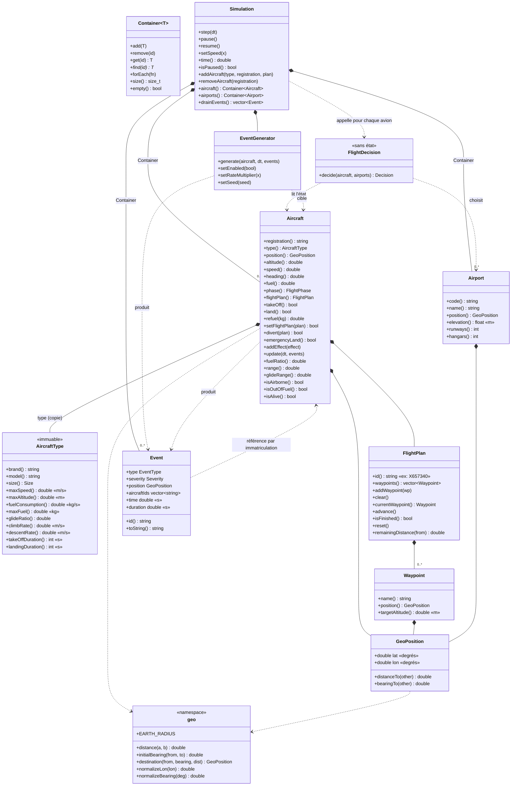
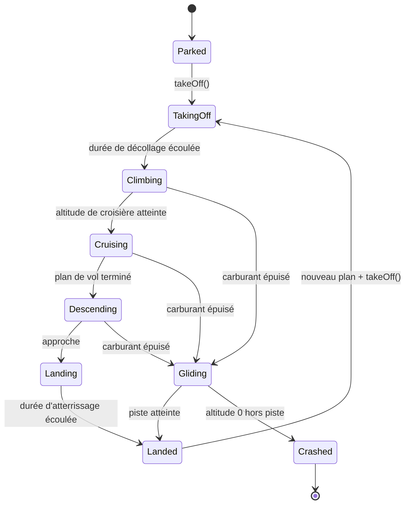
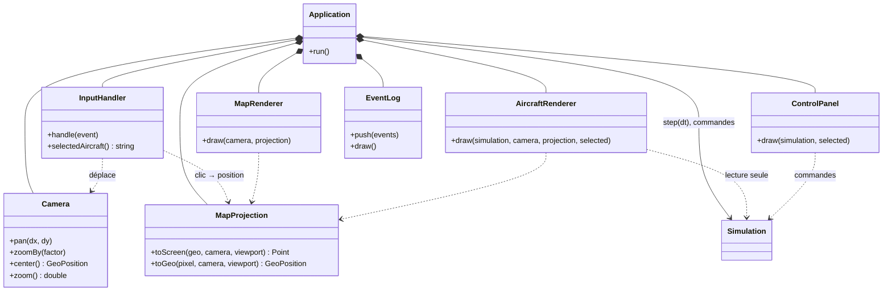
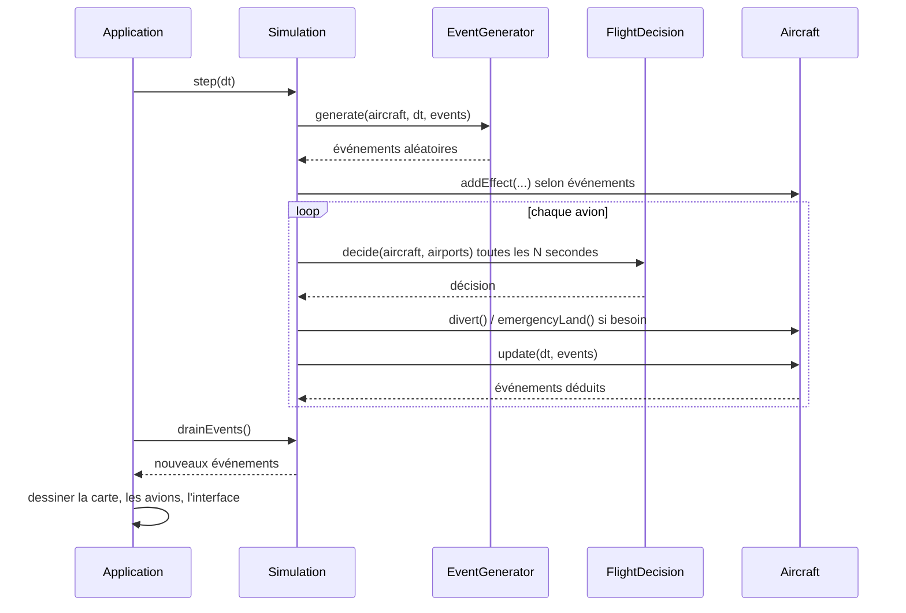

# Simairtra

Simulateur de trafic aérien simplifié écrit en C++.

Plusieurs avions évoluent dans un espace simulé. Un moteur de simulation avance par pas de temps et met à jour l'ensemble des objets à chaque itération.

> **Statut :** en cours de conception. L'architecture est en cours de réflexion et ce document évoluera avec le projet.

## Objectifs

- Simuler plusieurs avions simultanément sur une Terre sphérique (latitude / longitude / altitude).
- Faire avancer l'ensemble du monde par pas de temps (*fixed time step*).
- Rester simple, lisible et facilement extensible.

## Modèle de simulation

Chaque avion possède notamment :

| Attribut     | Description                                        |
| ------------ | -------------------------------------------------- |
| Position     | Coordonnées dans l'espace simulé                 |
| Vitesse      | Vitesse au sol / vitesse air                       |
| Altitude     | Altitude courante, avec montée/descente           |
| Cap          | Direction de déplacement (heading)                |
| Carburant    | Quantité restante, consommée au fil du temps     |
| Plan de vol  | Suite de points de passage (waypoints) à suivre   |
| Événements | Décollage, atterrissage, panne de carburant, etc. |

### Moteur de simulation

À chaque pas de temps `dt` :

1. Le moteur met à jour chaque avion (position, altitude, cap, carburant).
2. Les avions suivent leur plan de vol (navigation vers le prochain waypoint).
3. Les événements sont détectés et traités (arrivée à un waypoint, carburant bas, etc.).
4. L'état du monde est exposé (affichage console, logs, export…).

## Architecture

### Décisions

| Sujet | Décision | Raison |
|---|---|---|
| Types d'avions | `Aircraft` **contient** un `AircraftType` (composition, copie), pas d'héritage | Les types ne diffèrent que par des valeurs, pas par un comportement. Pas de polymorphisme ni de `unique_ptr`. |
| Coordonnées | Latitude / longitude en **degrés** (stockage), calculs en radians | Format de l'aviation réelle ; permet d'utiliser de vraies données. |
| Altitude | Modélisation **2D** : champ séparé de la position, en mètres, sans effet sur la géométrie (distances calculées à la surface). Sert aux plafonds, profils de montée/descente, contraintes de waypoints et distance de plané. Stockée en `float` (pas en `int` : les petits incréments `vitesse verticale × dt` seraient perdus ; même remarque pour le carburant). `float` aussi pour la vitesse, le carburant et le cap ; **`double` pour la latitude/longitude et le temps de simulation** *(proposé)*. | `float` suffit pour des grandeurs de quelques dizaines de milliers d'unités ; la position (~1,7 m de résolution en `float`) et le temps (qui s'accumule sur des heures) demandent la précision du `double`. |
| Modèle de Terre | **Sphère**, R = 6 371 000 m | Erreur ~0,3 % vs WGS84, formules simples. Passage à l'ellipsoïde possible plus tard. |
| Calculs géographiques | Namespace `geo` (fonctions libres), **pas de classe `Earth`** | Pas d'état à porter, un seul modèle. |
| Navigation | Grand cercle ; cap recalculé vers le waypoint courant à chaque pas | Comportement réel d'un avion. |
| Unités | **SI** en interne (m, m/s, s, kg) ; conversion à l'affichage uniquement | Évite les erreurs d'unités. |
| Cap | 0° = nord, sens horaire, intervalle [0, 360) | Convention aéronautique. |
| Phases de vol | `Parked → TakingOff → Climbing → Cruising → Descending → Landing → Landed` | Évite les actions incohérentes (ravitailler en vol, décoller deux fois) et fournit des événements naturels. |
| Décollage / atterrissage | Durée fixe en secondes (`int`), **propre à chaque `AircraftType`** (un Rafale décolle plus vite qu'un A320). Vitesse et altitude varient linéairement pendant la phase. | Simple pour démarrer, modèle affinable plus tard. |
| Atterrissage | **Automatique** à la fin du plan de vol ; `land()` reste une commande manuelle (urgence, déroutement) | Comportement réel ; sans cela l'avion tournerait jusqu'à épuisement du carburant. |
| Rôle de l'utilisateur | **Opérateur** : commandes directes aux avions (`takeOff`, `land`, `refuel`, création/changement de plan de vol), pause et accélération du temps, sélection d'un avion. Pas de contrôle aérien (cap/altitude en vol, conflits, pistes) pour l'instant. | Première version jouable à coût raisonnable ; les commandes sont déjà séparées de l'évolution interne, donc l'ajout de consignes (`targetHeading/Altitude/Speed`) reste possible plus tard. |
| Interface | Carte 2D d'une partie de la Terre, déplacement aux flèches, zoom, avions affichés en temps réel | |
| Accesseurs | Méthodes `const` sans préfixe `get` (`speed()`, `fuel()`, `heading()`…) ; pas de setters systématiques, l'état change via des commandes qui vérifient les conditions | Garde les objets dans un état cohérent. `AircraftType` : accesseurs seulement (immuable). |
| Événements | Deux familles : déterministes (déduits de l'état : `WaypointReached`, `TookOff`, `Landed`, `LowFuel`, produits par `Aircraft::update`) et **aléatoires** (pannes, fuite de carburant, météo, urgence médicale…, produits par un `EventGenerator`) | |
| Aléatoire | `std::mt19937` à **graine configurable**, injecté (pas global). Probabilités exprimées **par seconde** de simulation (`p·dt`), donc indépendantes du pas de temps. **Case à cocher dans l'UI** pour activer / désactiver l'aléatoire (désactivé = scénario déterministe). | Reproductibilité, tests, débogage. |
| Gravité des événements | Peuvent être **graves** : un crash est possible, pas seulement des perturbations | |
| Statistiques | Taux réalistes, définis comme **constantes dans un fichier `.h`** dédié, avec la source de chaque valeur en commentaire | Facile à ajuster et à justifier. |
| Effets | Un événement a un début, une durée et un effet ; l'avion garde une liste d'**effets actifs** (multiplicateurs, temps restant) appliqués et expirés dans `update(dt)` | Ex. fuite : consommation ×X ; vent de face : vitesse sol réduite ; panne moteur : `land()` forcé. |
| Définition des types d'avions | Un fichier `.h` par type dans `data/aircraft/`, rempli **à la main** (pas d'outil de création dans l'appli). Un `catalog.h` regroupe les types dans un tableau lu par l'UI (menu « ajouter un avion ») et par la simulation. | Pas de parseur ni de chemins à gérer, vérification de types par le compilateur, toutes les valeurs au même endroit. Contrepartie : ajouter un type demande une recompilation. |
| Identifiants | Chaque objet (`Aircraft`, `FlightPlan`, `Event`) a un champ `id` **défini à sa création** et jamais modifié ; `Container<T>` retrouve les objets par cet `id`. `Aircraft` a son immatriculation (`registration`) ; l'identifiant d'un `FlightPlan` est celui du vol (ex. X657340) ; celui d'un `Event` est attribué à son apparition. | Simple et classique ; les événements référencent les avions par leur identifiant. |
| Rayon d'arrivée aux waypoints | **Variable, une valeur prédéfinie par phase de vol**, en constantes dans un `.h` de réglages de navigation ; le rayon change à chaque transition de phase. Valeurs de départ (à ajuster) : `TakingOff` 1 km, `Climbing` 5 km, `Cruising` 5 km, `Descending` 3 km, `Landing` 1 km, `Gliding` 3 km. Un test de dépassement (la distance recommence à augmenter) valide aussi le point. | Un rayon trop petit peut être sauté (`vitesse × dt`), un rayon trop grand fait atterrir l'avion loin de la piste. Évolution prévue : rayon proportionnel à la vitesse, puis virage en anticipation `r·tan(Δcap/2)`. |
| Antiméridien (±180°) | **Géré** : longitude normalisée dans [-180, 180) après chaque déplacement ; différences de longitude toujours normalisées (jamais de comparaison directe) ; côté UI, la caméra reboucle sur la longitude et les lignes (routes, traînées) sont coupées au franchissement. Test unitaire sur un vol transpacifique. | Les avions traversent le Pacifique ; les formules sphériques n'en souffrent pas. |
| Pôles | **Limite documentée** : au pôle exact le cap est indéfini, les positions à \|latitude\| ≥ 89,9° ne sont pas garanties ; la carte (Mercator) est limitée à ±85,05° de latitude et la caméra est bornée. | Les routes polaires fonctionnent en grand cercle ; les cas dégénérés ne méritent pas de code spécial. |
| Montée / descente | `climbRate` et `descentRate` (m/s) sont des **constantes du type d'avion** ; l'altitude cible vient du plan de vol (contraintes des waypoints) ou de l'altitude de croisière ; `Aircraft::updateAltitude(dt)` rapproche l'altitude de la cible à ce taux (plafonnée par `maxAltitude`). La descente commence quand `distance restante ≤ (altitude − altitude d'arrivée) / tan(pente)`, pente d'approche de 3° (`navigation.h`). Seules les descentes d'urgence relèvent du pilote (facteur de taux dans `events.h`). | Ce sont des performances de l'avion ; l'arbre de décision choisit quoi faire, pas à quelle vitesse. Modèle simplifié : pas de variation avec l'altitude ni la masse. |
| Organisation du code | Trois cibles CMake : `core/` (bibliothèque statique sans dépendance graphique), `app/` (exécutable UI, qui dépend de `core/`) et `tests/` (tests du cœur). L'UI lit l'état de la simulation et lui envoie des commandes ; `core/` ne connaît jamais l'UI. | Cœur testable sans fenêtre, UI remplaçable. |
| Boucle de rendu | **Pas de temps fixe** de la simulation, découplé du rendu : `Application` accumule le temps réel et appelle `Simulation::step(dt)` autant de fois que nécessaire avant de dessiner. | La vitesse de simulation ne dépend pas du framerate ; pause et accélération faciles. |
| Aéroports | Un fichier `.h` par aéroport dans `data/airports/` (code OACI, nom, latitude/longitude, altitude, nombre de pistes, nombre de hangars), saisi à la main, plus un `catalog.h` qui les regroupe (même principe que les types d'avions). Pistes et hangars sont des **données** pour l'instant, sans effet sur la simulation. | Cohérent avec les types d'avions ; pas de parseur ni de fichier externe. |
| Décisions de vol | **Pas de modélisation du pilote** : « le pilote » est l'ensemble des décisions de vol de l'avion, prises par **un seul arbre de décision partagé** (`FlightDecision`, fonction sans état) évalué toutes les `PILOT_DECISION_INTERVAL` secondes. Entrées : état de l'avion, effets actifs, aéroports atteignables. Sorties : continuer, se dérouter vers un aéroport, atterrissage d'urgence. | Plus simple, testable, déterministe. Pas de personnalité par pilote. |
| Conteneur | `Container<T>` générique | Réutilisable pour avions, événements, etc. |
| Boucle principale | Classe `Simulation` (possède les conteneurs, le générateur d'événements et le temps, expose `step(dt)`) ; `Application` (UI) l'appelle à pas fixe via un accumulateur de temps ; `main` ne fait que lancer `Application::run()` | Cœur testable sans fenêtre. |
| Avion sans carburant | Phase `Gliding` (vol plané selon la finesse du type), puis `Landed` si une piste est atteinte, `Crashed` sinon | Comportement réel. |
| Build | CMake, compilation locale (pas de Docker) | Projet simple, débogage direct. |

### Diagrammes

Les décisions de vol sont portées par une fonction `FlightDecision` (arbre de décision partagé, sans état) ; il n'y a pas de classe « pilote » par avion.

#### Cœur : classes



#### Phases de vol



#### Interface : classes



#### Déroulement d'un pas de simulation



`Application` appelle `Simulation::step(dt)` autant de fois que nécessaire (accumulateur à pas fixe) avant de dessiner. `main` se limite à créer `Application` et à lancer `run()`.

### Événements

Chaque événement porte : un `id` (compteur tenu par `Simulation`, ex. `E000001`), un `type`, une **gravité** (`Info`, `Warning`, `Critical`, utilisée pour colorer et filtrer le journal), l'instant `time`, une `duration`, les `aircraftIds` concernés, une `position` (pour l'afficher sur la carte) et une charge utile selon le type (waypoint atteint, facteur de consommation, aéroport choisi…).

Les événements météo sont attachés à **un seul avion** dans un premier temps (une notion de zone géographique pourra venir plus tard).

Les astérisques (\*) marquent la **première version** ; les autres types s'ajoutent ensuite en ajoutant une valeur à l'énumération, une constante dans le `.h` de statistiques et son effet.

**Déduits de l'état** (déterministes, produits par `Aircraft::update`)

| Type | Déclencheur | Gravité |
|---|---|---|
| `TookOff` \* | Fin de la phase `TakingOff` | Info |
| `WaypointReached` \* | Distance au waypoint sous le seuil | Info |
| `CruiseAltitudeReached` | Altitude de croisière atteinte | Info |
| `DescentStarted` | Plan de vol terminé | Info |
| `Landed` \* | Fin de la phase `Landing`, ou vol plané qui rejoint une piste | Info |
| `Refueled` | Après un `refuel` | Info |
| `LowFuel` \* | Carburant sous la réserve (ex. 20 %) | Warning |
| `FuelCritical` | Carburant sous la réserve minimale | Critical |
| `FuelExhausted` \* | Carburant à 0, début du vol plané | Critical |
| `Crashed` \* | Altitude 0 hors piste | Critical |

**Aléatoires** (produits par `EventGenerator`, avec durée et effet sur l'avion)

| Type | Effet | Gravité |
|---|---|---|
| `Turbulence` \* | Légère perturbation de vitesse et d'altitude pendant quelques minutes | Info |
| `HeadWind` / `TailWind` | Vitesse sol réduite ou augmentée | Info |
| `Storm` | Déviation de la route, vitesse réduite | Warning |
| `FuelLeak` \* | Consommation multipliée | Warning |
| `EngineFailure` \* | Vitesse max réduite, atterrissage au plus proche | Critical |
| `EngineFire` | Idem, plus urgent | Critical |
| `Depressurization` | Descente d'urgence (~3 000 m), atterrissage | Critical |
| `MedicalEmergency` | Déroutement vers l'aéroport le plus proche | Warning |
| `BirdStrike` | Dégâts possibles (panne moteur ensuite) | Warning |
| `HydraulicFailure` | Atterrissage dégradé, durée d'atterrissage rallongée | Warning |

**Décisions de vol** (produites par `FlightDecision`)

| Type | Quand | Gravité |
|---|---|---|
| `Diverted` \* | Déroutement vers un aéroport | Warning |
| `EmergencyDeclared` \* | Panne grave ou carburant critique | Critical |
| `HoldingStarted` | Attente en vol (ajout futur) | Info |

**Système**

| Type | Quand |
|---|---|
| `AircraftCreated` \* | Ajout d'un avion par l'opérateur |
| `AircraftRemoved` | Suppression d'un avion |
| `FlightPlanChanged` | Changement de plan de vol par l'opérateur |

### Points restant à trancher

- Interface : bibliothèque graphique (SFML + Dear ImGui proposés) et projection de la carte (Mercator ou equirectangulaire).
- Règles exactes de l'arbre de décision (`FlightDecision`) et rôle des pistes / hangars dans la simulation (données seulement pour l'instant).
- Confirmer que `update(dt, events)` pousse les événements dans un conteneur passé en paramètre (retenu dans les diagrammes).

## Structure du dépôt

```
Simairtra/
├── readme.md
├── CMakeLists.txt        (à créer)
├── data/                 (constantes, voir ci-dessous)
│   ├── physics.h         rayon de la Terre, gravité
│   ├── navigation.h      rayons d'arrivée aux waypoints, par phase
│   ├── simulation.h      pas de temps, graine, seuils de carburant, intervalle du pilote
│   ├── events.h          statistiques des événements aléatoires (valeurs à sourcer)
│   ├── aircraft/
│   │   ├── a320.h        un .h de constantes par type d'avion
│   │   ├── rafale.h
│   │   └── catalog.h     (à créer avec la classe AircraftType)
│   └── airports/
│       ├── lfpg.h        un .h de constantes par aéroport
│       ├── kjfk.h
│       └── catalog.h     (à créer avec la classe Airport)
├── core/                 bibliothèque statique, SANS dépendance graphique
│   ├── geo, GeoPosition, AircraftType, Waypoint, FlightPlan,
│   │   Aircraft, Airport, FlightDecision, Event, EventGenerator,
│   │   Container, Simulation …      (à créer)
├── app/                  exécutable : fenêtre, carte, entrées, panneaux
│   ├── main.cpp          lance Application::run()
│   └── Application, Camera, MapProjection, MapRenderer, …   (à créer)
└── tests/                tests unitaires du cœur (geo, FlightPlan, Aircraft…)
```

Les fichiers actuels de `src/` (`main.cpp`, `aircrafts/aircraft.cpp`, `aircrafts/airliner.cpp`, tous vides) migrent vers `app/` et `core/` ; `airliner.cpp` disparaît (remplacé par les constantes de `data/aircraft/`).

## Compilation

Build avec CMake, compilation directement sur la machine.

Prérequis :

- Un compilateur C++17 ou supérieur (MSVC, GCC, Clang)
- CMake ≥ 3.16

## Utilisation

*À compléter.*

## Feuille de route

- [ ] Définir l'architecture
- [ ] Modèle d'avion (position, vitesse, altitude, cap, carburant)
- [ ] Boucle de simulation à pas de temps fixe
- [ ] Plans de vol et navigation par waypoints
- [ ] Système d'événements
- [ ] Sortie / visualisation (console, logs, puis éventuellement graphique)
- [ ] Tests unitaires

## Licence

*À définir.*
