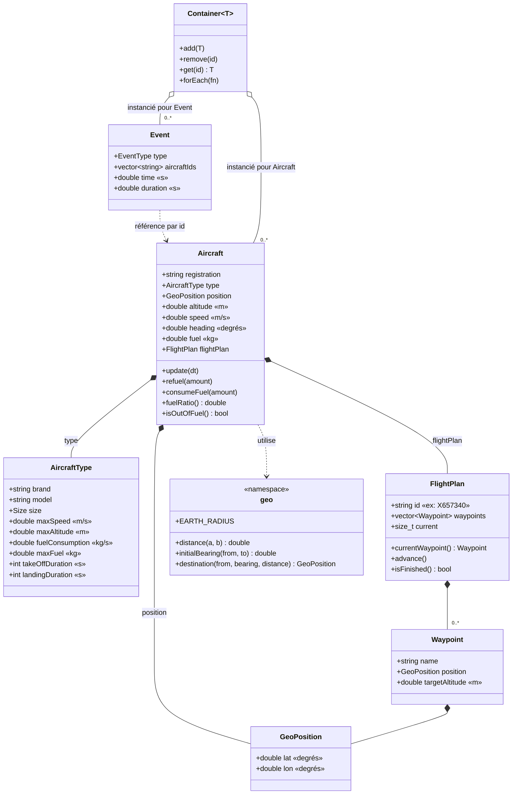

# Simairtra

Simulateur de trafic aérien simplifié écrit en C++.

Plusieurs avions évoluent dans un espace simulé. Un moteur de simulation avance par pas de temps et met à jour l'ensemble des objets à chaque itération.

> **Statut :** en cours de conception. L'architecture est en cours de réflexion et ce document évoluera avec le projet.

## Objectifs

- Simuler plusieurs avions simultanément sur une Terre sphérique (latitude / longitude / altitude).
- Faire avancer l'ensemble du monde par pas de temps (*fixed time step*).
- Rester simple, lisible et facilement extensible.

## Modèle de simulation

Chaque avion possède notamment :

| Attribut     | Description                                        |
| ------------ | -------------------------------------------------- |
| Position     | Coordonnées dans l'espace simulé                 |
| Vitesse      | Vitesse au sol / vitesse air                       |
| Altitude     | Altitude courante, avec montée/descente           |
| Cap          | Direction de déplacement (heading)                |
| Carburant    | Quantité restante, consommée au fil du temps     |
| Plan de vol  | Suite de points de passage (waypoints) à suivre   |
| Événements | Décollage, atterrissage, panne de carburant, etc. |

### Moteur de simulation

À chaque pas de temps `dt` :

1. Le moteur met à jour chaque avion (position, altitude, cap, carburant).
2. Les avions suivent leur plan de vol (navigation vers le prochain waypoint).
3. Les événements sont détectés et traités (arrivée à un waypoint, carburant bas, etc.).
4. L'état du monde est exposé (affichage console, logs, export…).

## Architecture

### Décisions

| Sujet | Décision | Raison |
|---|---|---|
| Types d'avions | `Aircraft` **contient** un `AircraftType` (composition, copie), pas d'héritage | Les types ne diffèrent que par des valeurs, pas par un comportement. Pas de polymorphisme ni de `unique_ptr`. |
| Coordonnées | Latitude / longitude en **degrés** (stockage), calculs en radians | Format de l'aviation réelle ; permet d'utiliser de vraies données. |
| Altitude | Champ séparé de la position, en mètres | |
| Modèle de Terre | **Sphère**, R = 6 371 000 m | Erreur ~0,3 % vs WGS84, formules simples. Passage à l'ellipsoïde possible plus tard. |
| Calculs géographiques | Namespace `geo` (fonctions libres), **pas de classe `Earth`** | Pas d'état à porter, un seul modèle. |
| Navigation | Grand cercle ; cap recalculé vers le waypoint courant à chaque pas | Comportement réel d'un avion. |
| Unités | **SI** en interne (m, m/s, s, kg) ; conversion à l'affichage uniquement | Évite les erreurs d'unités. |
| Cap | 0° = nord, sens horaire, intervalle [0, 360) | Convention aéronautique. |
| Phases de vol | `Parked → TakingOff → Climbing → Cruising → Descending → Landing → Landed` | Évite les actions incohérentes (ravitailler en vol, décoller deux fois) et fournit des événements naturels. |
| Décollage / atterrissage | Durée fixe en secondes (`int`), **propre à chaque `AircraftType`** (un Rafale décolle plus vite qu'un A320). Vitesse et altitude varient linéairement pendant la phase. | Simple pour démarrer, modèle affinable plus tard. |
| Atterrissage | **Automatique** à la fin du plan de vol ; `land()` reste une commande manuelle (urgence, déroutement) | Comportement réel ; sans cela l'avion tournerait jusqu'à épuisement du carburant. |
| Conteneur | `Container<T>` générique | Réutilisable pour avions, événements, etc. |
| Boucle principale | Dans `main` pour l'instant | À extraire plus tard dans une classe `Simulation` si besoin. |
| Build | CMake, compilation locale (pas de Docker) | Projet simple, débogage direct. |

### Diagramme de classes



`main` crée les `Container<Aircraft>` et `Container<Event>` et exécute la boucle : à chaque pas `dt`, appel de `update(dt)` sur chaque avion, collecte des événements produits, avance du temps.

### Points restant à trancher

- Identifiant utilisé pour référencer un avion dans `Container` et `Event` (immatriculation vs identifiant du vol).
- Liste exacte des valeurs de `EventType` et données associées à chaque type.
- Rayon d'arrivée à un waypoint (seuil de `WaypointReached`).
- Gestion de l'antiméridien (±180°) et des pôles, ou limite documentée.
- Vitesse de montée / descente : modèle simplifié à définir.

## Structure du dépôt

```
Simairtra/
├── readme.md
├── CMakeLists.txt        (à créer)
└── src/
    ├── main.cpp
    ├── aircrafts/
    │   ├── aircraft.cpp
    │   └── airliner.cpp  (à remplacer par un profil AircraftType)
    └── ...               (flightplan, event, container, geo à créer)
```

## Compilation

Build avec CMake, compilation directement sur la machine.

Prérequis :

- Un compilateur C++17 ou supérieur (MSVC, GCC, Clang)
- CMake ≥ 3.16

## Utilisation

*À compléter.*

## Feuille de route

- [ ] Définir l'architecture
- [ ] Modèle d'avion (position, vitesse, altitude, cap, carburant)
- [ ] Boucle de simulation à pas de temps fixe
- [ ] Plans de vol et navigation par waypoints
- [ ] Système d'événements
- [ ] Sortie / visualisation (console, logs, puis éventuellement graphique)
- [ ] Tests unitaires

## Licence

*À définir.*
